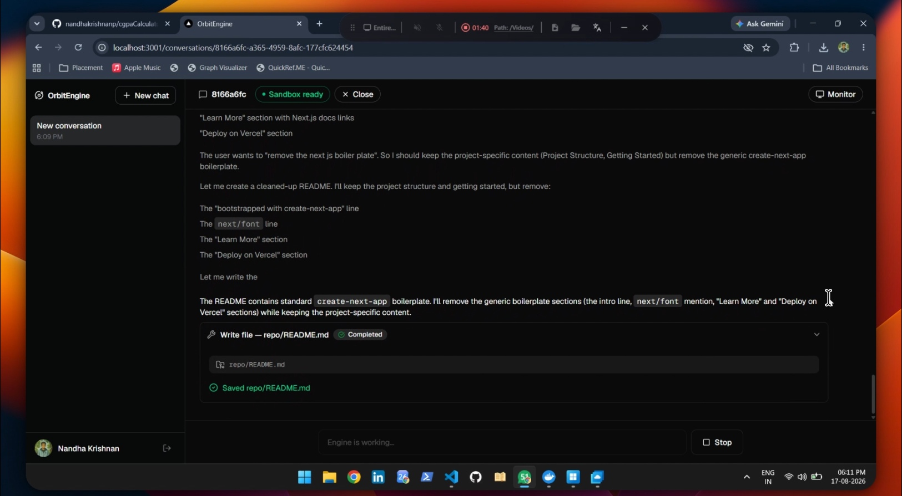
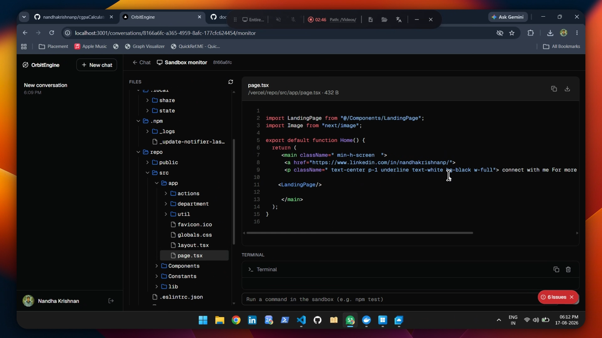
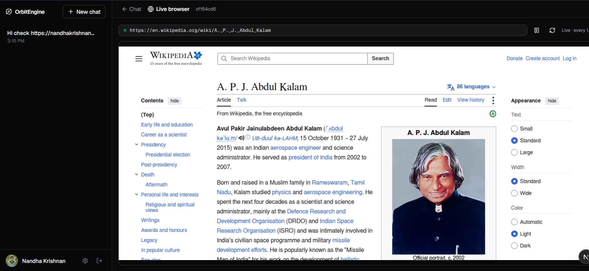

# OrbitEngine

<p align="center">
  <strong>Chat alongside a coding engine, wired to your GitHub.</strong><br/>
  Open a conversation, and an AI engine — running entirely in the cloud inside an
  isolated sandbox per conversation — reads your code, makes changes, runs tests,
  opens pull requests, and verifies its work in a real browser.<br/><br/>
  <em>You only ever talk in chat and review the result. Nothing runs on your machine.</em>
</p>

---

## ✨ See It In Action

### 1 · Chat with the engine

Describe what you want in plain English. Mention `@owner/repo` and the engine
clones it into its own sandbox. Every step streams live — commands, file edits,
pull requests — as compact, collapsible tool cards.



### 2 · Watch the sandbox live

Every conversation owns an isolated Firecracker microVM. The built-in monitor
gives you a real-time view into that machine: browse the full file tree, preview
files with syntax highlighting (images included), and run commands in a
streaming terminal.



### 3 · Watch the engine browse — live

In Build mode the engine has a headless browser of its own. When it navigates,
clicks, fills forms, or verifies a feature end-to-end, you can watch every frame
live — before it reports pass/fail back in chat.



---

## 🚀 What's Working

### Core loop

- **GitHub sign-in** (Auth.js) with sessions persisted in Postgres
- **Conversations** that persist across visits, with full chat history
- **Agent-driven repo cloning** — type `@owner/repo` in chat and the engine clones it
- **@-mention autocomplete** — pick repos from your GitHub installations
- **Streaming responses** with collapsible reasoning and tool call cards

### Engine tools

| Tool | What it does |
|------|--------------|
| `run_command` | Execute shell commands in the sandbox |
| `read_file` / `write_file` / `list_files` | Work with the filesystem |
| `create_pull_request` | Open a PR on GitHub when changes are ready |
| `create_issue` | Create issues from chat |
| `create_repository` | Bootstrap new projects |
| `browser_open` / `browser_snapshot` / `browser_click` / `browser_fill` / `browser_press` | Drive a headless browser by accessibility refs (`@e1`, `@e2`, …) |
| `browser_verify` | Check page title/URL/text visibility → pass/fail |

### Working modes

- **🟢 Build** — the full tool set: edit files, run commands, open PRs, browse the web
- **🔵 Plan** — strictly read-only (`read_file` + `list_files` only): analyse code,
  ask questions, get a plan. Writes, GitHub actions, and browsing are impossible
- Switchable per conversation from the prompt box (`⌘I`), persisted server-side

### Observability

- **Sandbox monitor** — file tree, file viewer with syntax highlighting *and image
  previews*, command runner with live streaming output
- **Live browser view** — screenshot polling (~1.5s) of the engine's browser
  session, with pause/resume and manual refresh
- **Dynamic model selection** — per-conversation provider + model picker, backed by
  encrypted provider keys in Settings

---

## 🛠 Tech Stack

| Layer | Technology |
|-------|------------|
| Frontend | Next.js 16 (App Router, TypeScript, Tailwind CSS) |
| Auth | Auth.js (NextAuth v5) + GitHub provider |
| Database | PostgreSQL |
| Sandbox | Vercel Sandbox — one Firecracker microVM per conversation |
| AI runtime | Vercel AI SDK — server-side tool calling + streaming |
| Browser | [agent-browser](https://github.com/vercel-labs/agent-browser) (headless Chrome over CDP) |
| Hosting | Vercel |

## 📦 Getting Started

Prerequisites: **Node 24+**, **Docker** (for the local Postgres).

### 1. Install

```bash
npm install
```

### 2. Postgres

```bash
docker run -d --name orbitengine-postgres \
  -e POSTGRES_USER=orbitengine -e POSTGRES_PASSWORD=orbitengine \
  -e POSTGRES_DB=orbitengine -p 5433:5432 postgres:16-alpine

# create the schema (idempotent)
Get-Content db/schema.sql | docker exec -i orbitengine-postgres \
  psql -U orbitengine -d orbitengine -v ON_ERROR_STOP=1
```

### 3. GitHub App

1. Create an app at `https://github.com/settings/apps/new`.
2. Set the **Callback URL** to `http://localhost:3001/api/auth/callback/github`
   and enable **Request user authorization (OAuth) during installation**.
3. The **Webhook URL is not needed** — the engine works over the API.
4. Copy the app's **Client ID** and **Client Secret**.

### 4. Environment

```bash
cp .env.example .env.local   # then fill in AUTH_GITHUB_ID / AUTH_GITHUB_SECRET
```

`.env.local` is gitignored — secrets are never committed.

### 5. Run

```bash
npm run dev
```

Open http://localhost:3001, sign in with GitHub, and start a conversation.

## 📚 Documentation

| Document | Contents |
|----------|----------|
| [`docs/architecture.md`](docs/architecture.md) | System architecture overview |
| [`docs/foldersstructure.md`](docs/foldersstructure.md) | Full folder structure & module map |
| [`docs/PRD.md`](docs/PRD.md) | Product requirements document |
| [`docs/v2.md`](docs/v2.md) | v2 feature spec |
| [`docs/adr/`](docs/adr/) | Architecture decision records (0001–0022) |
| [`CONTEXT.md`](CONTEXT.md) | Domain glossary |

## License

[MIT](LICENSE)
